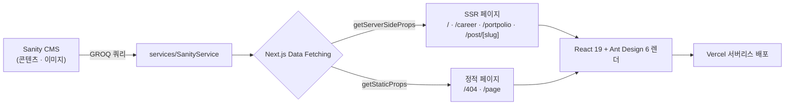

# Dynamic_Kwon Dev Blog & Portfolio

> Headless CMS(Sanity)를 백엔드로 사용하는 개인 기술 블로그 겸 포트폴리오 웹 애플리케이션.
> Next.js(Pages Router) 기반 SSR/SSG로 동작하며 Vercel에 배포되어 있습니다.

**🔗 라이브 데모:** https://dev-blog-woad.vercel.app/
**📦 저장소:** https://github.com/vonovo123/portpolio

---

## 📌 포트폴리오 메타

> 포트폴리오 사이트의 프로젝트 카드/상세에 그대로 옮겨 쓸 수 있도록 정리한 요약입니다.

| 항목 | 내용 |
| --- | --- |
| 프로젝트명 | Dynamic_Kwon Dev Blog & Portfolio |
| 한 줄 소개 | Sanity 헤드리스 CMS 기반의 개인 기술 블로그 & 포트폴리오 |
| 유형 | 개인 프로젝트 (1인 개발 — 기획 · 프론트엔드 · CMS 연동 · 배포) |
| 기간 | _(작성 필요: 예) 2022.01 ~ 진행 중_ |
| 담당 역할 | 프론트엔드 개발 전반, Sanity 스키마/콘텐츠 모델링, 배포/운영 |
| 배포 | Vercel (GitHub 연동 자동 CI/CD) |
| 라이브 URL | https://dev-blog-woad.vercel.app/ |
| 저장소 URL | https://github.com/vonovo123/portpolio |
| 핵심 키워드 | `Next.js` `React 19` `SSR/SSG` `Headless CMS(Sanity)` `Ant Design 6` `Portable Text` `Vercel` `반응형 웹` |

---

## 🧭 프로젝트 개요

개발 학습 내용을 기록하는 **기술 블로그**와 경력·프로젝트를 소개하는 **포트폴리오**를 하나의 사이트로 통합한 프로젝트입니다.
글·프로필·프로젝트 등 모든 콘텐츠는 코드 배포 없이 **Sanity(헤드리스 CMS)** 에서 관리하며, Next.js가 요청 시점(SSR) 또는 빌드 시점(SSG)에 이를 받아 렌더링합니다.

- **콘텐츠와 코드의 분리:** 글 작성·수정이 배포와 무관하게 이뤄지도록 CMS를 도입.
- **검색 최적화(SEO):** 서버 사이드 렌더링과 Open Graph 메타 태그로 크롤러 친화적 페이지 제공.
- **읽기 경험:** 목차(TOC), 코드 하이라이팅, 반응형 레이아웃으로 문서 가독성에 집중.

---

## ✨ 주요 기능

### 블로그
- 카테고리 / 서브카테고리 기반 글 네비게이션 (데스크톱 · 모바일 메뉴 분리)
- 최근 글 · 인기 글 목록, 캐러셀(슬라이드)을 통한 최근 글 노출
- 글 목록 페이지네이션 및 무한 스크롤

### 콘텐츠 렌더링
- **Portable Text(Sanity Block Content)** 와 **Markdown** 혼합 렌더링
- 코드 블록 **신택스 하이라이팅** (`react-syntax-highlighter`)
- 문서 헤딩 기반 **목차(TOC) 자동 생성** 및 스크롤 위치 하이라이팅(IntersectionObserver)
- 글 **조회수** 집계

### 댓글
- 댓글 / 대댓글(중첩) 작성·조회
- 스크롤 하단 감지를 통한 댓글 **무한 스크롤 로딩**

### 포트폴리오 · 커리어
- 프로젝트 소개 목록 페이지
- 경력 타임라인 페이지

### 공통 · UX
- 반응형(모바일/데스크톱) 레이아웃 및 모바일 슬라이드 메뉴
- `ABOUT ME` 프로필 패널 토글
- SEO/OG 메타 태그(`HeadMeta`, `_document`), Google AdSense 광고 영역

---

## 🛠 기술 스택

| 구분 | 사용 기술 |
| --- | --- |
| 프레임워크 | [Next.js](https://nextjs.org/) 16 (Pages Router) |
| UI 라이브러리 | [React](https://react.dev/) 19 |
| 컴포넌트 | [Ant Design](https://ant.design/) 6, [@ant-design/icons](https://ant.design/components/icon) 6 |
| CMS / 데이터 | [Sanity](https://www.sanity.io/) — `@sanity/client` 7, `@sanity/image-url` 2 |
| 콘텐츠 렌더링 | `@portabletext/react` 6 (Portable Text), `react-markdown` 10 + `remark-gfm` 4, `react-syntax-highlighter` 16 |
| 유틸 | `dayjs`, `lodash`, `classnames`, `react-transition-group` |
| 스타일 | CSS Modules + Ant Design CSS-in-JS |
| 린팅 | ESLint 9 (flat config) + `eslint-config-next` 16 |
| 배포 / 인프라 | Vercel (Node 22.x 서버리스) |

---

## 🏗 아키텍처 & 데이터 흐름



- **데이터 접근 계층(`services/`)** 에서 Sanity GROQ 쿼리를 캡슐화하여 페이지 로직과 분리.
- 콘텐츠 성격에 따라 **요청 시점 렌더링(SSR)** 과 **빌드 시점 정적 생성(SSG)** 을 혼용.
- 이미지는 `@sanity/image-url`로 CDN URL을 생성해 최적화된 크기로 제공.

---

## 🔍 기술적 도전과 해결 (Troubleshooting)

> 포트폴리오에서 "문제 해결 능력"을 보여줄 수 있는 핵심 사례들입니다.

### 1. 레거시 스택 전면 현대화
- **문제:** Next.js 12 / React 18 / Ant Design 4 / Sanity 3 기반의 오래된 스택으로, 최신 런타임에서 유지보수가 어려움.
- **해결:** **Next 16 · React 19 · Ant Design 6 · Sanity 7 · ESLint 9(flat config)** 로 전면 업그레이드하고 각 라이브러리의 Breaking Change를 대응.
  - `@sanity/block-content-to-react` → `@portabletext/react`(`PortableText`) 마이그레이션
  - `react-markdown` v9+ 변경에 맞춰 코드 렌더러 재작성(`inline` prop 제거 대응)
  - Ant Design 글로벌 CSS → CSS-in-JS 전환(`antd/dist/reset.css` 적용)
  - 최신 컴파일러가 검출한 `const` 재할당 등 잠재 버그 수정

### 2. Vercel 프로덕션 500 에러 디버깅 (ERR_REQUIRE_ESM)
- **문제:** 로컬은 정상인데 배포 후 SSR 페이지만 500. 정적 페이지·API는 정상이라 원인 파악이 까다로움.
- **분석:** "정적 페이지·API 정상 / SSR 페이지만 실패" 로 범위를 좁히고, 런타임 로그에서 원인 확인 →
  `react-syntax-highlighter`(CommonJS)가 **ESM 전용 패키지 `refractor`를 `require()`** 하면서 구버전 Node에서 `ERR_REQUIRE_ESM` 발생. (로컬 Node 24는 `require(ESM)`을 허용해 문제가 드러나지 않았음)
- **해결:** `next.config.js`의 `transpilePackages`로 해당 패키지를 **서버 번들에 포함**시켜 런타임의 외부 `require`를 제거하고, 배포 Node 버전을 `22.x`로 고정.

### 3. Ant Design 6 전환에 따른 스타일 회귀 대응
- **문제:** CSS-in-JS 전환 후 `<Image>`가 주입하는 `.ant-image .ant-image-img { width:100%; height:auto }` 규칙이 로컬 클래스보다 우선순위가 높아, 지정한 이미지 크기가 무시되고 정렬이 깨짐.
- **해결:** 래퍼를 기준으로 하는 `:global(.ant-image)` 선택자로 우선순위를 높여 고정 크기·`object-fit: cover`를 강제. Flexbox로 아이콘·텍스트 정렬을 재정비.

### 4. 민감 정보(토큰) 분리
- **문제:** Sanity 프로젝트 ID와 토큰이 코드/설정에 하드코딩되어 노출.
- **해결:** `.env.local` 및 Vercel 환경 변수로 분리하고, 필요한 키를 `.env.example`로 문서화.

---

## 📂 프로젝트 구조

```
portpolio/
├── pages/                # 라우트 (index, career, portpolio, post/[slug], 404, _app, _document, api)
├── components/           # UI 컴포넌트 (About, Header, Footer, Carousel, Comment, Element 등)
├── services/             # 데이터 접근 계층 (SanityService, GitProfileService)
├── utils/                # 헬퍼 (Observer, Headings, LocalStorage 등)
├── styles/               # 전역 스타일 및 CSS Modules
├── fonts/ · assets/ · public/   # 폰트 · 정적 리소스
├── next.config.js        # Next.js 설정 (env 매핑, transpilePackages)
└── eslint.config.mjs     # ESLint flat config
```

---

## 🚀 로컬 실행

```bash
# 1) 의존성 설치
npm install

# 2) 환경 변수 설정 (.env.example 참고)
cp .env.example .env.local   # 값 채우기

# 3) 개발 서버
npm run dev                  # http://localhost:3000

# 프로덕션 빌드/실행
npm run build && npm run start
```

> 요구 사항: **Node.js 22.x** (Next.js 16 기준 20.9 이상)

---

## 🔑 환경 변수

| 변수 | 설명 |
| --- | --- |
| `SANITY_PROJECT_ID` | Sanity 프로젝트 ID |
| `SANITY_AUTH_TOKEN` | Sanity 읽기 토큰 |

로컬은 `.env.local`, 배포 환경은 **Vercel → Project → Settings → Environment Variables** 에 등록합니다.
